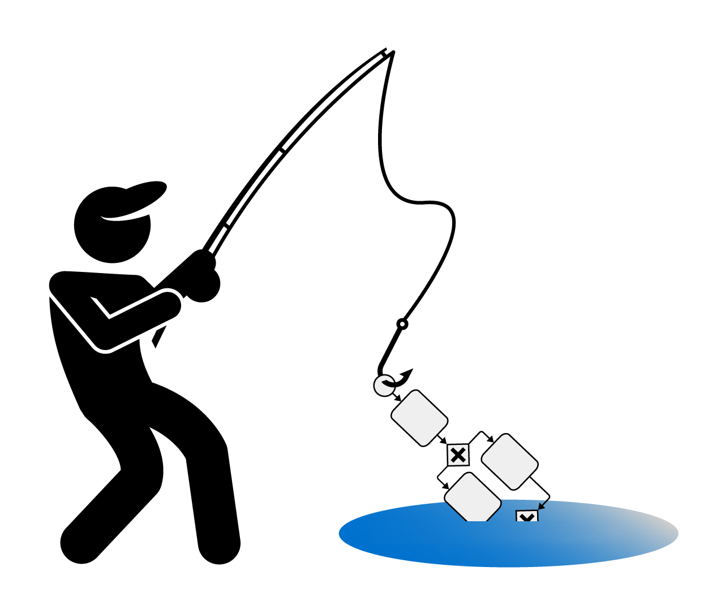
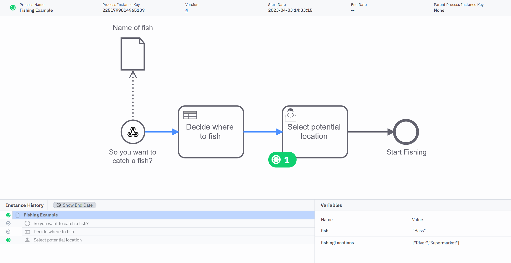

# Fishing Webhook Example
This is an example process that implements a webhook as a start event so that process can be started via REST

## How to deploy
 
If you don't already have one, you'll need a Camunda 8 SaaS account. You get a free on here. 

Once you have that, upload the models from the ProcessModels folder into a folder in the Web Web Modeler and deploy them to a Camunda 8 Cluster. 
If all goes according to plan you should be able to see the process in the Operate webapp.

Selecting the start event and going to the webhook tab on the properties panel will reveal the webhook url

